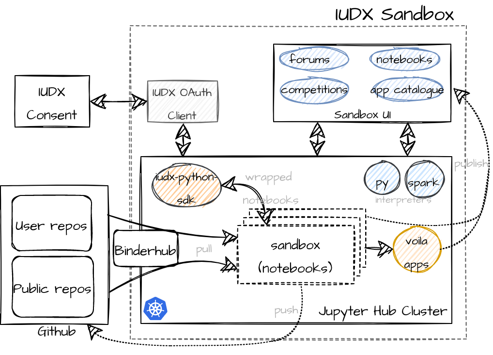

# iudx-sandbox-backend
The IUDX Sandbox is a JupyterHub based platform where users of IUDX can 
1. Download sample historical data for datasets
2. Explore IUDX curated notebooks of interesting use cases
3. Interactively perform data analytics on these IUDX live/historical datasets

The architecture of the backend system is as shown below

The sandbox can be accessed [here](https://sandbox.iudx.org.in).

## Setup
- [Setup the JupyterHub backend](./setup/jupyterhub)
- [Setup the application backend](./docs/backend_setup.md)
- [Load applications into the system](./docs/onboard.md)
